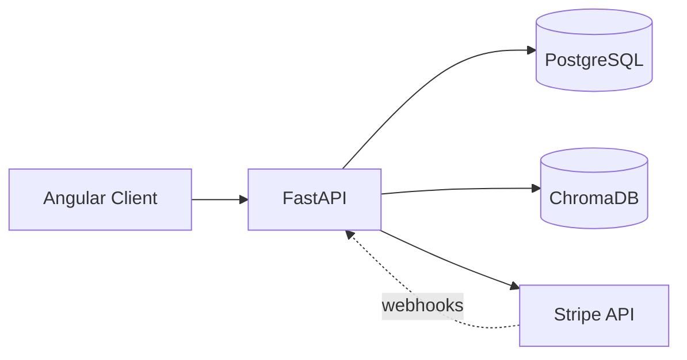

# RAG API

A FastAPI backend for a domain-specific AI assistant. Users chat through 
a web client; the backend retrieves relevant context from a curated 
knowledge base and generates grounded responses. Includes JWT auth, 
Stripe subscriptions, and persistent chat rooms.

## Stack

- **FastAPI** — HTTP API and async request handling
- **PostgreSQL** — users, chat rooms, messages, subscription state
- **ChromaDB** — vector store for the knowledge base
- **JWT** — access + refresh token rotation
- **Stripe** — subscription billing and webhook handling
- **Angular** — frontend client (separate repo)

## Architecture

Requests authenticate via JWT and hit a chat room scoped to the user. 
The RAG pipeline retrieves relevant chunks from the shared ChromaDB 
collection and injects them into the LLM prompt. Subscription status 
gates access; Stripe webhooks keep it in sync.

## Features

**Auth**
- JWT access + refresh token rotation
- Email verification with expiring codes
- Password reset flow

**Chat**
- Multiple chat rooms per user
- Persistent message history with role tracking (user / assistant / system)
- Messages scoped to rooms; rooms scoped to users

**RAG pipeline**
- Curated knowledge base ingested via CLI: chunked, embedded, stored in ChromaDB
- Top-k retrieval against the shared collection
- Retrieved context injected into LLM prompt for grounded responses

**Billing**
- Stripe subscription lifecycle (create, renew, cancel)
- Webhook handling for state sync
- Subscription status checked on protected routes

## Documentation

- [Database schema](ragapi/documentation/database_schema.md) — tables, relationships, constraints
- [API reference](ragapi/documentation/ragapi_endpoints.md) — endpoint reference and auth flows

## What I learned

- Designing a relational schema for a multi-user chat app (users → rooms → messages)
- Implementing JWT auth with proper refresh-token rotation
- Handling Stripe webhooks: idempotency, signature verification, keeping state in sync
- Moving a RAG pipeline from pickle and tensor files to a proper vector database

## Roadmap

- Hybrid retrieval (BM25 + vector + RRF) for keyword-heavy queries
- Contextual retrieval — prepending document-level context to chunks before embedding
- Reranker on top of retrieval results
- Streaming responses over WebSocket
- OAuth provider integration (Google / Discord) for sign-in
